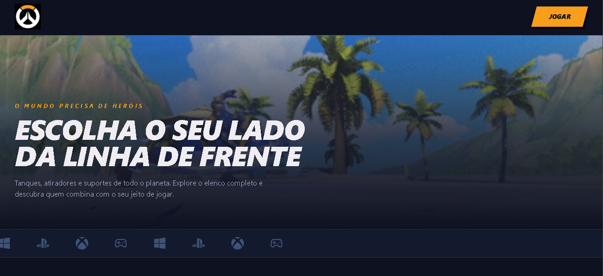
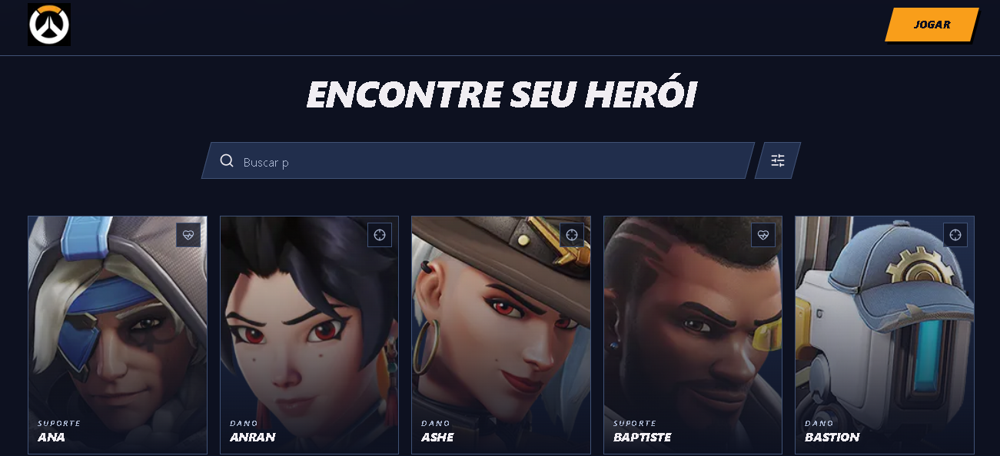
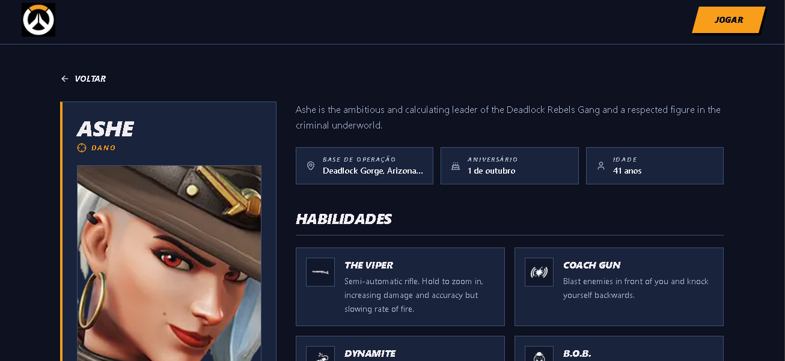

# wsFrontend-Fabrica26.2

Aplicação web que consome a [OverFast API](https://overfast-api.tekrop.fr) para listar
e detalhar os heróis de Overwatch. Projeto do workshop de Front-End da Fábrica de
Software 26.2.

**Acesse:** https://ws-frontend-fabrica26-2-inky.vercel.app





## Funcionalidades

- Listagem completa dos heróis com imagem, nome e função
- Busca em tempo real por nome ou função, ignorando acentos e maiúsculas
- Filtro por função: tanque, dano e suporte
- Paginação de 20 heróis por página
- Página de detalhes com descrição, base de operação, aniversário, idade, pontos de
  vida, habilidades e história
- Layout responsivo

## Tecnologias

| Camada | Tecnologia |
| --- | --- |
| Framework | Next.js 16 (App Router) |
| Linguagem | TypeScript |
| Estilos | Tailwind CSS v4 |
| Componentes | Shadcn/ui |
| Ícones | lucide-react, react-icons |
| Testes | Vitest, Testing Library |
| Deploy | Vercel |

## Arquitetura

O projeto separa a comunicação com a API da interface:

```
Interface (components)
      ↓
Lógica de tela (HeroesExplorer, utils)
      ↓
Services (overwatchApi.ts)
      ↓
OverFast API
```

O arquivo `src/services/overwatchApi.ts` é o único ponto do projeto que faz
chamadas HTTP. Nenhum componente conhece a URL da API.

```
src/
├── app/            # Rotas do App Router
├── components/     # Componentes de interface
├── config/         # Constantes da API
├── hooks/          # Lógica reutilizável de React
├── services/       # Comunicação HTTP
├── types/          # Tipagens da resposta da API
└── utils/          # Funções puras
```

## Decisões técnicas

**Por que separar o service da interface?**

Todas as chamadas HTTP ficam em um único arquivo, o `overwatchApi.ts`. Nenhum
componente sabe qual é a URL da API nem como a resposta chega. Se a OverFast mudar de
endereço, ou se um dia eu precisar trocar de API, altero esse arquivo e o resto do
projeto continua funcionando. Além disso, quando um componente cuida de layout e de
requisição ao mesmo tempo, ele fica difícil de entender e de reaproveitar.

**Por que `fetch` em vez de Axios?**

O Axios ajuda quando existe autenticação, interceptadores ou muitas rotas diferentes.
Aqui a API é pública e o projeto faz duas chamadas: uma para listar os heróis e outra
para buscar o detalhe. Nesse cenário, instalar uma biblioteca a mais só aumentaria o
tamanho do projeto sem resolver nada. O `fetch` do Next ainda tem uma vantagem: aceita
a opção `revalidate`, que guarda a resposta em cache por 24 horas. Como os dados dos
heróis quase não mudam, isso evita repetir a mesma requisição a cada acesso.

**Por que verificar `response.ok` no service?**

Essa é a parte que mais me chamou atenção quando estudei o material. O `fetch` só
rejeita a Promise quando a requisição nem sai, como em uma queda de conexão. Se o
servidor responder 404 ou 500, ele considera que deu certo e entrega a resposta
normalmente. Sem a verificação de `response.ok`, o projeto tentaria ler um erro como
se fosse a lista de heróis e quebraria em outro lugar, longe da causa real. Checando
ali, o erro aparece onde ele acontece e a página consegue mostrar uma mensagem para o
usuário.

**Por que o filtro é uma função pura fora do componente?**

A função `filtrarHerois` recebe a lista e os critérios e devolve a lista filtrada. Ela
não usa estado, não altera nada fora dela e sempre devolve o mesmo resultado para a
mesma entrada. Isso trouxe duas vantagens. A primeira é o teste: consigo verificar o
filtro sem renderizar React, passando uma lista pequena e conferindo a saída. A
segunda é a leitura do componente, que ficou responsável só por controlar o estado da
tela e passar os dados adiante, sem misturar a lógica de busca no meio do JSX.


## Limitações conhecidas

A descrição dos heróis e o texto das habilidades vêm em inglês porque a OverFast API
não oferece tradução: ela extrai o conteúdo das páginas da Blizzard em inglês.

## Testes

O projeto tem 21 testes cobrindo a normalização de texto usada na busca, a formatação
de datas, as funções de filtro e paginação, e o componente de paginação.

```bash
npm run test
```

## Rodando localmente

```bash
git clone https://github.com/Erick-lin0/wsFrontend-Fabrica26.2.git
cd wsFrontend-Fabrica26.2
npm install
npm run dev
```

Acesse `http://localhost:3000`.

## Scripts

| Comando | Descrição |
| --- | --- |
| `npm run dev` | Servidor de desenvolvimento |
| `npm run build` | Build de produção |
| `npm run lint` | ESLint |
| `npm run test` | Testes |

## Padrão de commits

O projeto segue o [Conventional Commits](https://www.conventionalcommits.org/pt-br/):
`feat`, `fix`, `docs`, `style`, `refactor`, `test` e `chore`. Cada etapa do
desenvolvimento foi feita em uma branch própria e integrada por Pull Request.

## Segurança

Todo texto vindo da API é renderizado por interpolação do React, que escapa o
conteúdo automaticamente. O projeto não usa `dangerouslySetInnerHTML`. Links externos
usam `rel="noopener noreferrer"`.

## Licença de uso

Overwatch® é uma marca registrada da Blizzard Entertainment, Inc. Todas as imagens,
nomes e demais materiais pertencem aos seus respectivos titulares. Este é um projeto
acadêmico, sem fins comerciais e sem vínculo oficial com a Blizzard. Os dados são
fornecidos pela OverFast API, mantida por Valentin "TeKrop" Porchet.

---

Desenvolvido por [José Erick](https://github.com/Erick-lin0).
